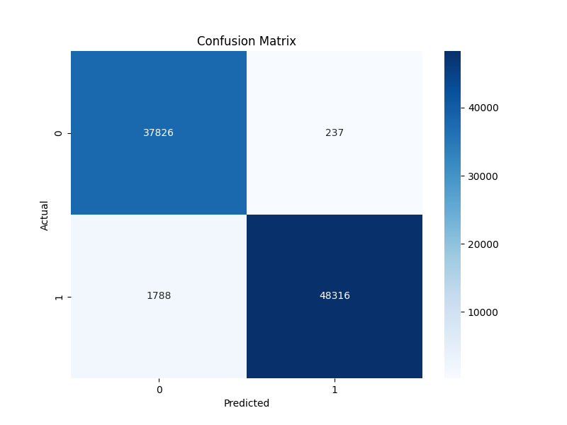

# ChurnBot

An AI-powered marketing assistant for **churn prediction** and **customer insights**, integrating a **churn classification model** with an **LLM-powered chatbot** for actionable marketing analytics.

## Table of Contents
1. [Overview](#1-overview)
2. [Project Structure](#2-project-structure)
3. [Installation](#3-installation)
4. [Usage](#4-usage)
5. [Data](#5-data)
6. [Model](#6-model)
7. [Results](#7-results)
---

## 1. Overview
**ChurnBot** helps **predict customer churn** using a combination of:
- **Churn Classification Model**: Identifies customers at risk of leaving.
- **LLM-powered Chatbot**: Converts marketing queries into structured data insights.
- **Streamlit Interface**: Provides an interface to chat.

## 2. Project Structure
```
.
├── data/                      # Data files
│   ├── raw/                   # Raw data
│   └── processed/             # Processed/cleaned data
├── src/                      # Source code
│   ├── api/                  # API-related code
│   │   ├── app.py            # Main API application
│   │   ├── utils.py          # Utility functions for the API
│   │   └── feature_extraction_from_text.py  # Feature extraction for text
│   ├── app/                  # Application-related code
│   │   └── app.py            # Streamlit application
│   ├── config/               # Configuration files
│   │   └── paths.py          # Path configurations
│   ├── data/                 # Data-related code
│   │   └── data_cleaning.py  # Data cleaning scripts
│   ├── features/             # Feature engineering code
│   │   └── feature_engineering.py  # Feature engineering scripts
│   ├── models/               # Model-related code
│   │   └── train_model.py    # Model training scripts
│   ├── scripts/              # Scripts for various tasks
│   │   └── predict.py        # Prediction scripts
│   ├── visualization/        # Visualization-related code
│   │   └── visuals.py        # Visualization scripts
│   └── main.py               # Main program file
├── models/              # Generated Models
├── reports/          # Generated reports and visualizations
│   ├── plots/
│   ├── metrics.csv
│   ├── predictions.csv 
├── docs/             # Documentation & diagrams
├── requirements.txt  # Dependencies
├── README.md         # Project documentation
├── setup.py          # Project setup
├── .gitignore        # Files and directories to ignore
```

## 3. Installation
### Prerequisites
- Python 3.5+
- Ollama: This project requires Ollama to interact with open-source language models. You can download it from [Ollama's official website](https://ollama.com/).
- Virtual environment (optional but recommended)

### Steps
```bash
# Clone the repository
git clone https://github.com/yourusername/churnbot.git
cd churnbot

# Create and activate a virtual environment
python -m venv venv
.\venv\Scripts\activate  # On Mac use `source venv/bin/activate`

# Install dependencies
pip install -r requirements.txt

# Setup
pip install -e .
```

## 4. Usage
### Run the main file
```bash
run_main
```

### Run Ollama
```bash
ollama serve ( You can check it using "Ollama run llama3" )
```

### Running the API
```bash
uvicorn src.api.app:app --reload
```

### Starting the Streamlit Application
```bash
streamlit run src/app/app.py
```


## 5. Data
- **Source**: https://www.kaggle.com/datasets/muhammadshahidazeem/customer-churn-dataset?select=customer_churn_dataset-training-master.csv
- **Features**: Age, Gender, Tenure, Usage Frequency, Support Calls, Payment Delay, Subscription Type, Contract Length, Total Spend, Last Interaction
- **Preprocessing**: handling missing values, duplicates, redundant columns, encoding categorical variables and scaling numerical features. 

## 6. Model
- **Algorithm**: XGBoost
- **Evaluation Metrics**: Accuracy, Precision, Recall, F1-score

## 7. Results
Example results from the churn classification model:
```
Accuracy: 97%
Precision: 99%
Recall: 96%
F1-score: 97%   
```
**Confusion Matrix:**  
